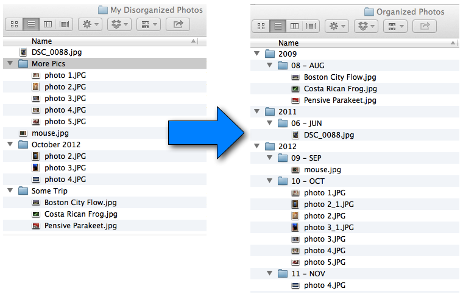

# SortPhotos

SortPhotos is a Python script that organizes photos into folders by date (year, year/month, or year/month/day).  If you're like me then your growing collection of files are contained in a bunch of folders, some with a date like "Sep 2010", and others which names like "Camping Trip".  SortPhotos takes this collection of folders and files and reorganizes them into a hierarchy of folders by year, by year and month, or by year month and day.  It will work with any file, not just photos, but it works best with *.jpg and *.tiff files because it can use EXIF data that stays with the file.  For other files (like *.mov or *.avi) SortPhotos will sort them using the creation date.  The script is also useful for transferring files from your camera into your collection of nicely organized photos.

# Usage

SortPhotos is intended to be used primarily from the command line.  To see all the options, invoke help

    python sortphotos.py -h

The simplest usage is to specify a source directory (the directory where your mess of files is currently located---it will be searched recursively) and a destination directory (where you want the files and directories to go).

    python sortphotos.py /Users/Me/MessyDirectory /Users/Me/Pictures

## move rather than copy
There are several options that can be invoked.  For example the default behavior is to copy files from your source directory to your destination directory.  That is useful, for example, if you're copying files from your camera.  However, if you just want to organize existing files on your computer it's **much** faster to move the files rather than copy them (especially if videos are involved).  This is done with the ``-m`` or ``--move`` flag.

    python sortphotos.py -m /source /destination

## sort by year, month, day
By default folders are sorted by year then month.  So for example if cool_picture.jpg was taken on June 1, 2010 the resulting directory hierarchy will look like: 2010 > June > cool_picture.jpg.  You can choose to sort only by year ``--sort y``, by year then month ``--sort m`` (default), or by year then month then day ``--sort d``.  So for example to move your files (rather than copy) and sort by year, month and day you would call

    python sortphotos.py -m --sort d /source /destination

## duplicate removal
SortPhotos will *always* check to make sure something with the same file name doesn't already exist where it's trying to write, so that you don't unintentionally overwrite a file. It this occurs it will append a number on the end of the file.  So for example if photo.jpg was taken on June 1, 2010 but 2010 > June > photo.jpg already exists then the new file will be copied as photo_1.jpg and so on.  SortPhotos will go one step further and if it finds a file of the same name, it will then run a file compare to see if the files are actually the same.  If they are *exactly* the same, it will just skip the copy (or move) operation.  This will prevent you from having duplicate files.  However you have the option of turning this off (not the name comparison, that will always happen, just the weeding out of duplicates).  This option would be useful, for example, if you are copying over a bunch of new photos that you are sure don't already exist in your organized collection of photos.  It's a little faster to skip duplicate detection.   Invoke the option ``--keep-duplicates`` in order to skip duplicate detection.

    python sortphotos.py --keep-duplicates /source /destination

## choose which file types to search for
You can restrict what types of files SortPhotos looks for in your source directory.  By default it only looks for the most common photo and video containers ('jpg', 'tiff', 'avi', 'mov').  You can change this behavior through the ``extensions`` argument.  Note that it is not case sensitive so if you specify 'jpg' as an extension it will search for both jpg and JPG files or even jPg files.  For example say you want to copy and sort only the *.gif and *.avi files you would call

    python sortphotos.py /source /destination --extensions gif avi

If you only want to sort the files that (potentially) have EXIF data then

    python sortphotos.py /source /destination --extensions jpg tiff

You may want to use this for files that aren't photos or videos at all

    python sortphotos.py /source /destination --extensions docx xlsx pptx

To sort every possible file type

    python sortphotos.py /source /destination --extensions *

However, this option will copy even hidden files like .DS_Store.

# Acknowledgments

SortPhotos grabs EXIF data from the photos using [EXIF.py](https://github.com/ianare/exif-py) which was written by Gene Cash and Thierry Bousch.

# License

Copyright (c) 2013, S. Andrew Ning.  All rights reserved.

All code is licensed under [The MIT License](http://opensource.org/licenses/mit-license.php).
